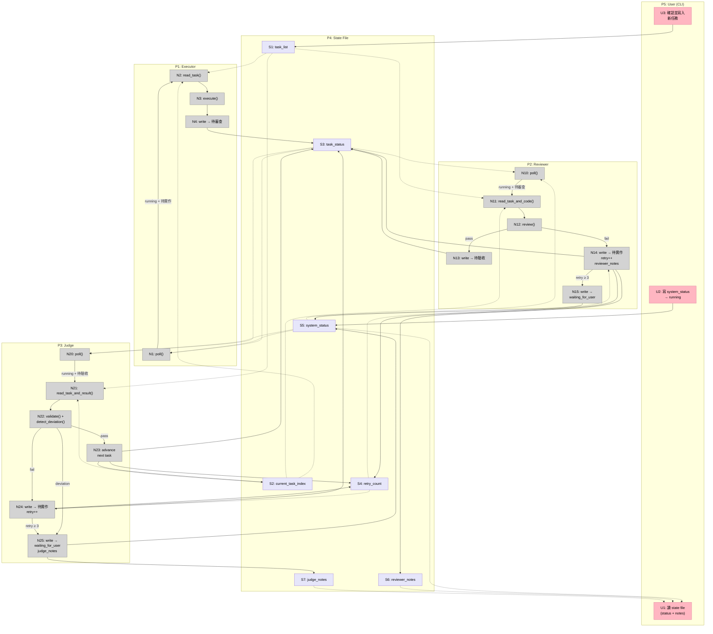

# Breadboard — Claude Code 多角色工作流


```mermaid
flowchart TB
    subgraph P4["P4: State File"]
        S1["S1: task_list"]
        S2["S2: current_task_index"]
        S3["S3: task_status"]
        S4["S4: retry_count"]
        S5["S5: system_status"]
        S6["S6: reviewer_notes"]
        S7["S7: judge_notes"]
    end

    subgraph P1["P1: Executor"]
        N1["N1: poll()"]
        N2["N2: read_task()"]
        N3["N3: execute()"]
        N4["N4: write → 待審查"]
        N1 -->|running + 待實作| N2
        N2 --> N3
        N3 --> N4
    end

    subgraph P2["P2: Reviewer"]
        N10["N10: poll()"]
        N11["N11: read_task_and_code()"]
        N12["N12: review()"]
        N13["N13: write → 待驗收"]
        N14["N14: write → 待實作\nretry++\nreviewer_notes"]
        N15["N15: write →\nwaiting_for_user"]
        N10 -->|running + 待審查| N11
        N11 --> N12
        N12 -->|pass| N13
        N12 -->|fail| N14
        N14 -->|retry ≥ 3| N15
    end

    subgraph P3["P3: Judge"]
        N20["N20: poll()"]
        N21["N21: read_task_and_result()"]
        N22["N22: validate() +\ndetect_deviation()"]
        N23["N23: advance\nnext task"]
        N24["N24: write → 待實作\nretry++"]
        N25["N25: write →\nwaiting_for_user\njudge_notes"]
        N20 -->|running + 待驗收| N21
        N21 --> N22
        N22 -->|pass| N23
        N22 -->|fail| N24
        N22 -->|deviation| N25
        N24 -->|retry ≥ 3| N25
    end

    subgraph P5["P5: User (CLI)"]
        U1["U1: 讀 state file\n(status + notes)"]
        U2["U2: 寫 system_status\n→ running"]
        U3["U3: 確認並寫入\n新任務"]
    end

    %% Poll reads
    S3 -.-> N1
    S5 -.-> N1
    S3 -.-> N10
    S5 -.-> N10
    S3 -.-> N20
    S5 -.-> N20

    %% Task reads
    S1 -.-> N2
    S2 -.-> N2
    S1 -.-> N11
    S2 -.-> N11
    S1 -.-> N21
    S2 -.-> N21

    %% Retry reads
    S4 -.-> N14
    S4 -.-> N24

    %% User reads
    S5 -.-> U1
    S6 -.-> U1
    S7 -.-> U1

    %% Writes — Executor
    N4 --> S3

    %% Writes — Reviewer
    N13 --> S3
    N14 --> S3
    N14 --> S4
    N14 --> S6
    N15 --> S5

    %% Writes — Judge
    N23 --> S2
    N23 --> S3
    N23 --> S4
    N24 --> S3
    N24 --> S4
    N25 --> S5
    N25 --> S7

    %% Writes — User
    U2 --> S5
    U3 --> S1

    classDef ui fill:#ffb6c1,stroke:#d87093,color:#000
    classDef nonui fill:#d3d3d3,stroke:#808080,color:#000
    classDef store fill:#e6e6fa,stroke:#9370db,color:#000

    class U1,U2,U3 ui
    class N1,N2,N3,N4,N10,N11,N12,N13,N14,N15,N20,N21,N22,N23,N24,N25 nonui
    class S1,S2,S3,S4,S5,S6,S7 store
```
```

已更新：
- S6 → `reviewer_notes`（Reviewer 退回時的原因）
- S7 → `judge_notes`（Judge 暫停或偵測偏離時的說明）
- N14 寫入 S6，N25 寫入 S7
