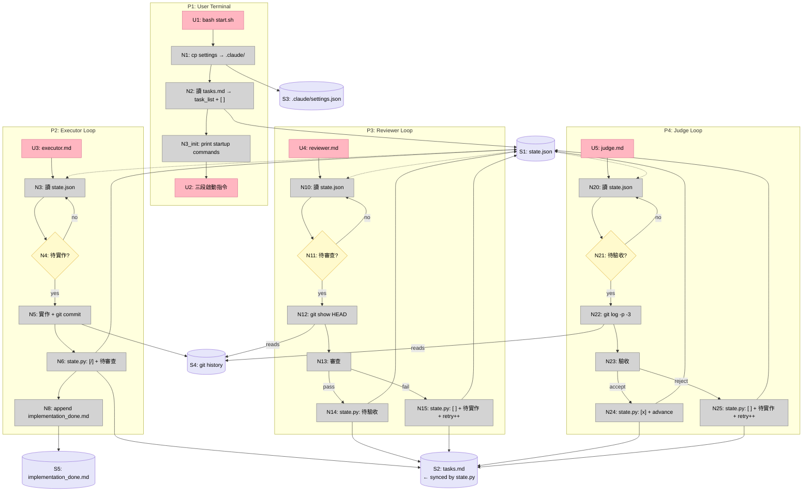

# Claude Code 多角色工作流 v2 — Breadboard

## Places

| # | Place | Description |
|---|-------|-------------|
| P1 | User Terminal | 執行 start.sh，開啟三個 agent session |
| P2 | Executor Loop | Executor 的 /loop sbx session |
| P3 | Reviewer Loop | Reviewer 的 /loop sbx session |
| P4 | Judge Loop | Judge 的 /loop sbx session |

## Data Stores

| # | Store | Description |
|---|-------|-------------|
| S1 | state.json | task_status、retry_count、system_status、task_list（帶 `[ ]`/`[/]`/`[x]` 前綴）、notes |
| S2 | tasks.md | 由 state.py 同步自 state.json task_list（agents 不直接寫入） |
| S3 | .claude/settings.json | Agent 權限設定 |
| S4 | git history | Executor commit 的程式碼變更 |
| S5 | workflow/implementation_done.md | Executor 實作摘要（append-only，僅供使用者查閱） |

## UI Affordances

| # | Place | Affordance | Control | Wires Out | Returns To |
|---|-------|------------|---------|-----------|------------|
| U1 | P1 | `bash start.sh` | invoke | → N1 | — |
| U2 | P1 | 三段啟動指令（Judge / Reviewer / Executor 順序） | render | — | — |
| U3 | P2 | workflow/agents/executor.md | read | — | → N3 |
| U4 | P3 | workflow/agents/reviewer.md | read | — | → N10 |
| U5 | P4 | workflow/agents/judge.md | read | — | → N20 |

## Code Affordances

### P1 — start.sh

| # | Affordance | Control | Wires Out | Returns To |
|---|------------|---------|-----------|------------|
| N1 | `cp settings/agent-claude-settings.json .claude/settings.json` | call | → S3, → N2 | — |
| N2 | 從 tasks.md 讀入任務，加 `[ ]` 前綴寫入 state.json task_list | call | → S1, → N3_init | — |
| N3_init | 印出三段啟動指令（順序：Judge → Reviewer → Executor） | call | → U2 | — |

### P2 — Executor Loop

| # | Affordance | Control | Wires Out | Returns To |
|---|------------|---------|-----------|------------|
| N3 | 讀取 state.json | call | — | → N4 |
| N4 | system_status == running AND task_status == 待實作? | conditional | → N5（yes）/ → N3（no，等下輪） | — |
| N5 | 實作程式碼 + git commit | call | → S4, → N6 | — |
| N6 | state.py: task_list[current] → `[/]`、task_status → 待審查（同步 tasks.md） | call | → S1, → S2, → N8 | — |
| N8 | Append to implementation_done.md（日期時間、任務名稱、摘要 ≤200字、files changed、commit hash） | call | → S5 | — |

### P3 — Reviewer Loop

| # | Affordance | Control | Wires Out | Returns To |
|---|------------|---------|-----------|------------|
| N10 | 讀取 state.json | call | — | → N11 |
| N11 | system_status == running AND task_status == 待審查? | conditional | → N12（yes）/ → N10（no，等下輪） | — |
| N12 | `git show HEAD` | call | — | → N13 |
| N13 | 審查程式碼品質與任務符合度 | call | → N14（pass）/ → N15（fail） | — |
| N14 | state.py: task_status → 待驗收（同步 tasks.md） | call | → S1, → S2 | — |
| N15 | state.py: task_list[current] → `[ ]`、task_status → 待實作、retry_count++、reviewer_notes（同步 tasks.md） | call | → S1, → S2 | — |

### P4 — Judge Loop

| # | Affordance | Control | Wires Out | Returns To |
|---|------------|---------|-----------|------------|
| N20 | 讀取 state.json | call | — | → N21 |
| N21 | system_status == running AND task_status == 待驗收? | conditional | → N22（yes）/ → N20（no，等下輪） | — |
| N22 | `git log -p -3` | call | — | → N23 |
| N23 | 驗收任務需求符合度 + 偏離偵測 | call | → N24（accept）/ → N25（reject） | — |
| N24 | state.py: task_list[current] → `[x]`、advance current_task_index、reset retry_count（同步 tasks.md） | call | → S1, → S2 | — |
| N25 | state.py: task_list[current] → `[ ]`、task_status → 待實作、retry_count++、judge_notes（同步 tasks.md） | call | → S1, → S2 | — |

---

## Diagram

---

## v2 新增對照表

| 新增 Affordance | 對應 Shape part |
|----------------|----------------|
| N1, N2, N3_init, U2 | A1 — start.sh 改版（含 task_list 初始化） |
| U3/U4/U5 路徑改為 `workflow/agents/` | A2 — 目錄重整 |
| N12（`git show HEAD`） | A3 — Reviewer git 上下文 |
| N22（`git log -p -3`） | A3 — Judge git 上下文 |
| N6, N15, N24, N25（state.py 帶前綴 + 同步 tasks.md） | A4 — 任務標記（state.json 為 source of truth） |
| N8, S5 | A5 — 實作摘要紀錄 |
